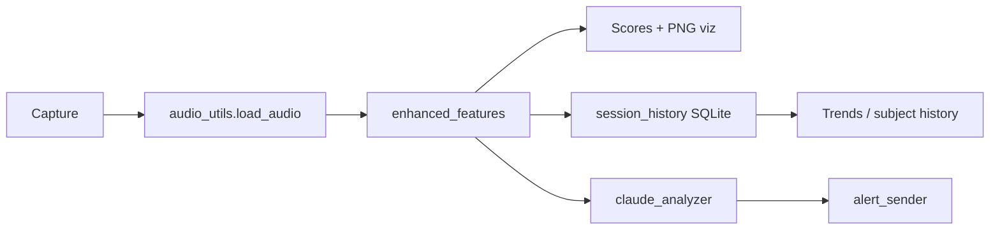

# NeuroSense AI — How It Works (Developer Guide)

This document describes the **current desktop prototype**: architecture, data flow, modules, and day-to-day commands.

For product/strategy context, see [HOW_IT_WORKS_INVESTORS.md](./HOW_IT_WORKS_INVESTORS.md).

---

## 1. Pipeline overview

Every session follows the same core path:

```
Record or load audio
    → Feature extraction (EnhancedFeatureExtractor)
    → Behavioral + stress scores
    → Optional: Claude AI interpretation
    → Optional: email alert
    → SQLite session history + 7-day trend
```



---

## 2. Repository map

| Module | Role |
|--------|------|
| `simple_recorder.py` | Record a short clip; saves to `recordings/<subject>/recording_NNN.wav` |
| `audio_analyzer.py` | Analyze a file; prints metrics, saves PNG chart, logs session |
| `claude_demo.py` | Full pipeline: record/load → features → Claude → alert → history |
| `enhanced_features.py` | **Single source of truth** for feature extraction and scoring |
| `audio_utils.py` | Load WAV/MP3/M4A/etc.; pick newest file per subject |
| `session_history.py` | SQLite persistence, trends, subjects, context tags |
| `claude_analyzer.py` | Anthropic API integration |
| `alert_sender.py` | SMTP alerts when Claude status is "Needs Attention" |
| `demo_recorder.py` | Multi-scenario demo recorder (baseline/stressed/fatigued) |

Data locations:

| Path | Contents |
|------|----------|
| `recordings/<subject>/recording_001.wav` | Per-subject numbered audio |
| `recordings/analysis_*.png` | Waveform / spectrum / VAD charts |
| `data/neurosense_history.db` | Session history (SQLite) |
| `.env` | `CLAUDE_API_KEY`, SMTP settings |
| `alert_emails.json` | Alert recipients |

---

## 3. Feature extraction

All analysis flows through `EnhancedFeatureExtractor` in `enhanced_features.py`.

Aligned to the researcher **Acoustic Feature Extraction** objective:

| Family | Fields |
|--------|--------|
| **Pitch** | `f0_mean` / `pitch_mean`, `pitch_std`, `pitch_range`, `pitch_variation` |
| **Speech rate** | `speaking_rate` (syl/sec), `speaking_rate_wpm` (acoustic proxy), `response_latency_sec` |
| **Intensity** | `rms_energy`, `peak_amplitude`, `peak_to_average_ratio` (`dynamic_range`) |
| **Voice quality** | `tension`, `roughness`, `jitter`, `shimmer`, `spectral_flux` |
| **Pauses / disfluencies** | `pause_ratio`, `pause_count`, `mean_pause_duration_sec`, `cutoff_rate_per_min`, `filler_proxy_rate_per_min` |
| **Prosody** | `prosody_contour_slope`, `prosody_rhythm_regularity`, `prosody_emphasis` |
| **Articulation** | `spectral_centroid_hz`, `articulation_clarity`, `slur_index`, `over_articulation_index` |
| **Composites** | `stress_level` (0–100), `behavioral_score` (0–100), `vocal_stability` |

Also retains spectral helpers: `dominant_frequency`, `frequency_std`, `high_frequency_ratio`, `speech_ratio`, `energy_variance`.

**ASR note:** true word-accurate WPM and lexical fillers need a transcript. Current WPM / filler metrics are **acoustic proxies** so audio-only pipelines still work.

Stress level is computed first; behavioral score may subtract points for high stress.

---

## 4. Subject tracking

Each person (subject) has an isolated trail of recordings and metrics.

**Folder convention:**

```
recordings/
  person1/
    recording_001.wav
    recording_002.wav
  person2/
    recording_001.wav
```

**Rules:**

- `--subject person1` normalizes to lowercase `person1` (alphanumeric, `-`, `_`).
- `simple_recorder.py` **requires** `--subject`; next filename comes from `next_recording_path()`.
- Recording numbers are derived from filename (`recording_003`) or the next free number (DB + disk).
- Subject can be inferred from path: `recordings/person1/recording_001.wav` → `person1`.
- Baselines and trends are **scoped per subject** (and optionally per context tag).

---

## 5. Context tags

Optional labels link a session to situational context (e.g. `"after work"`, `"morning check-in"`).

- Passed via `--tag "after work"` on `audio_analyzer.py` or `claude_demo.py`.
- Stored in SQLite `context_tag` column.
- Trend comparison can filter by tag: baseline = prior sessions for **same subject + same tag**.
- `session_history.py --tags` shows average scores grouped by tag.

---

## 6. Session history (SQLite)

Database: `data/neurosense_history.db`

**Key columns:** `subject_id`, `recording_number`, `context_tag`, `behavioral_score`, `stress_level`, `speech_ratio`, `claude_status`, `pipeline`, `recorded_at`.

**Important behavior:** trend is printed **before** save, so the current run is not included in its own baseline.

**CLI:**

```powershell
python session_history.py                    # recent sessions + 7-day baseline
python session_history.py --subjects         # list all subjects
python session_history.py --subject person1  # one subject's history
python session_history.py --subject person1 --tags
python session_history.py --tag "after work"
```

---

## 7. Setup

```powershell
cd c:\neurosense-dev
python -m venv venv
.\venv\Scripts\Activate.ps1
pip install -r requirements.txt
```

Create `.env`:

```
CLAUDE_API_KEY=your_key_here
ALERT_SMTP_HOST=smtp.gmail.com
ALERT_SMTP_PORT=587
ALERT_SMTP_USER=you@example.com
ALERT_SMTP_PASSWORD=your_app_password
```

**Always use the venv Python** — system Python will miss dependencies (e.g. `matplotlib`).

For MP3/M4A: `pip install librosa` (already in requirements) **and** install [ffmpeg](https://ffmpeg.org/download.html) on PATH.

---

## 8. Common commands

### Record

```powershell
python simple_recorder.py --subject person1
python simple_recorder.py --subject person2 --duration 10
```

### Analyze (metrics + chart + history)

```powershell
python audio_analyzer.py --subject person1
python audio_analyzer.py recordings\person1\recording_001.wav --subject person1 --tag "morning"
python audio_analyzer.py --history --subject person1
```

### Full AI pipeline

```powershell
python claude_demo.py --subject person1
python claude_demo.py --subject person1 --file recordings\person1\recording_001.wav --tag "after work"
python claude_demo.py --history --subject person1
```

### Inspect history

```powershell
python session_history.py --subjects
python session_history.py --subject person1
python session_history.py --tags
```

---

## 9. Claude + alerts

`claude_analyzer.py` sends the feature dict to Claude (`claude-sonnet-4-20250514`) and parses:

- `status` (e.g. Normal, Needs Attention)
- `confidence`
- `raw_analysis` (full narrative)

If `should_send_alert(status)` is true, `alert_sender.py` emails recipients from `alert_emails.json`.

---

## 10. Extension points (wearable / API)

See [WEARABLE_PORT_ROADMAP.md](./WEARABLE_PORT_ROADMAP.md) and [Watchdawg-NeuroSense-Integration.md](./Watchdawg-NeuroSense-Integration.md).

**Reuse as-is:**

- Feature schema from `enhanced_features.py`
- Claude prompt + parsing in `claude_analyzer.py`
- Alert rules in `alert_sender.py`

**Next likely builds:**

1. FastAPI `/analyze` endpoint (audio or feature dict in → scores out)
2. Physician dashboard over `session_history` queries
3. Wearable/phone capture → same pipeline on backend

The modular split (`audio_utils` → `enhanced_features` → `session_history` → `claude_analyzer`) is intentional so mobile/backend can call the same layers without the CLI scripts.

---

## 11. Known limitations (prototype)

- Desktop mic only; not real-time streaming
- Human voice demo (production target: research subjects / clinical use cases per product docs)
- Chart PNGs for same filename across subjects can overwrite (`analysis_recording_001.png`)
- No auth/multi-tenant backend yet
- Clinical validation is a separate effort from this codebase

---

## 12. Quick reference — flags

| Flag | Scripts | Purpose |
|------|---------|---------|
| `--subject ID` | recorder, analyzer, claude_demo, history | Per-person tracking |
| `--tag LABEL` | analyzer, claude_demo, history | Context (trigger, time of day) |
| `--file PATH` | claude_demo | Analyze existing file |
| `--history` | analyzer, claude_demo | Show session list |
| `--subjects` | session_history | List all subjects |
| `--tags` | session_history | Scores grouped by tag |
