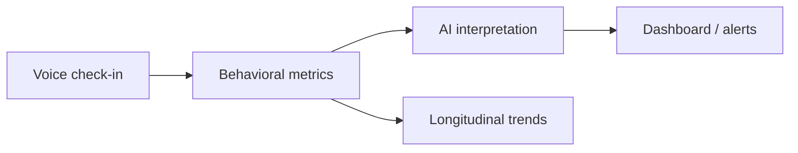

# NeuroSense AI — How It Works (Investor Overview)

NeuroSense AI turns **short voice samples** into **objective behavioral metrics** and **AI-assisted clinical insights** — helping track stress, engagement, and neurological/behavioral change over time.

This document explains what the product does today, why it matters, and where it is headed. For technical detail, see [HOW_IT_WORKS_DEV.md](./HOW_IT_WORKS_DEV.md).

---

## The problem

Behavioral and neurological assessment often relies on:

- Subjective observation
- Infrequent clinic visits
- Self-report questionnaires

Those methods miss **what happens between appointments** — early warning signs, response to treatment, or correlation with daily triggers (sleep, work, trauma reminders).

NeuroSense adds a **continuous, non-invasive signal**: the voice.

---

## What NeuroSense does

In a typical session (5–10 seconds of speech):

1. **Capture** — A short voice recording from a microphone (today: desktop; tomorrow: phone or wearable).
2. **Analyze** — Proprietary signal processing extracts measurable features: energy, vocal activity, pitch stability, speaking rate, and composite **stress** and **behavioral scores** (0–100).
3. **Interpret** — Claude AI reads the metrics and produces a plain-language assessment (status, confidence, recommendations).
4. **Alert** — If the assessment flags concern, configured caregivers or clinicians receive an email notification.
5. **Track over time** — Every session is stored per **subject** with optional **context tags** (e.g. "after work", "morning check-in") so trends can be compared week over week.

---

## What makes it different

| Capability | Benefit |
|------------|---------|
| **Objective scores** | Repeatable numbers, not just notes |
| **Short check-ins** | Low burden — seconds, not minutes |
| **Per-subject history** | Each person has their own baseline and recording sequence |
| **Context tags** | Link scores to triggers, time of day, or events |
| **AI layer** | Translates raw metrics into actionable narrative for clinicians |
| **Privacy-friendly path** | Architecture supports sending **metrics only** to the cloud (not raw audio) in production |

---

## Who it is for

**Near term (demonstrated today):**

- Research and clinical teams monitoring behavioral change
- TBI and neurological assessment workflows (prototype uses human voice to validate the pipeline)

**Strategic integration (documented roadmap):**

- **Watchdawg** — voice check-ins on a watch, simple patient view, physician trend dashboard
- **Anxiety / PTSD progression** — longitudinal stress and engagement trends alongside standard care

NeuroSense is designed to **complement** clinical judgment and validated scales — not replace diagnosis or treatment decisions.

---

## A day in the life (example)

**Patient / subject:**

- Morning: 5-second voice check-in tagged `"morning check-in"`
- Evening after a stressful event: check-in tagged `"after trigger"`

**System:**

- Computes stress score (e.g. 75/100) and behavioral score (e.g. 55/100)
- Compares to that person's 7-day average
- AI summary: "Moderate suppression; monitor energy trend"
- If flagged: alert to care team

**Clinician:**

- Opens history for `person1`: recordings #1, #2, #3…
- Sees whether stress is rising after tagged triggers
- Uses trends to inform next visit, medication review, or outreach

---

## Product building blocks (today)

| Component | Status |
|-----------|--------|
| Voice capture & numbered per-subject recordings | Working |
| Feature extraction & stress/behavioral scoring | Working |
| Visualization (waveform, spectrum, activity) | Working |
| Claude AI interpretation | Working |
| Email alerts | Working |
| SQLite history, subjects, tags, 7-day trends | Working |
| Wearable / watch app | Roadmap (Watchdawg integration) |
| Physician web dashboard | Roadmap |
| Clinical validation studies | Roadmap |

The **core analysis engine is built**. Remaining work is primarily **integration, scale, and validation** — not fundamental research unknowns.

---

## Business model angles (illustrative)

- **Clinical / research SaaS** — per-site or per-patient monitoring
- **Platform layer** — API licensed to digital health partners (e.g. Watchdawg)
- **Enterprise alerts & reporting** — care teams, trial sponsors, telehealth platforms

Differentiation: turnkey **voice → score → trend → AI narrative** in one pipeline, with a clear path to on-device or phone-side processing for privacy.

---

## Privacy & trust

- Check-ins can be designed so **raw audio never leaves the device** — only derived metrics are stored (roadmap aligns with this; current desktop demo stores local WAV files for development).
- Subject IDs and context tags support audit trails without exposing unnecessary PHI in filenames.
- AI outputs are **adjunct** to licensed clinical workflows; transparency about what is measured and how clinicians use trends is part of the product story.

---

## Roadmap (high level)

| Phase | Focus |
|-------|--------|
| **Now** | Desktop prototype: record → analyze → AI → history per subject |
| **Next** | Backend API + physician trend view |
| **Then** | Phone / wearable capture (Watchdawg), push notifications |
| **Later** | On-device feature extraction, validation vs. clinical scales (GAD-7, PCL-5, etc.) |

See [WEARABLE_PORT_ROADMAP.md](./WEARABLE_PORT_ROADMAP.md) for architecture options (wearable captures → phone or cloud analyzes).

---

## One-paragraph summary

NeuroSense AI captures brief voice samples, converts them into standardized stress and behavioral scores, enriches them with AI-generated clinical-style summaries, and tracks each subject's progress over time — including optional context (triggers, time of day). It gives care teams **objective, longitudinal insight between visits**, with a clear path from today's working prototype to watch-based check-ins and physician dashboards through partners like Watchdawg.

---

## Demo flow (for live presentations)

1. Record: `python simple_recorder.py --subject person1`
2. Analyze: `python audio_analyzer.py --subject person1 --tag "morning check-in"`
3. AI: `python claude_demo.py --subject person1 --file recordings\person1\recording_001.wav`
4. Show history: `python session_history.py --subjects`

Use two subjects (`person1`, `person2`) to show **isolated** histories and baselines.
